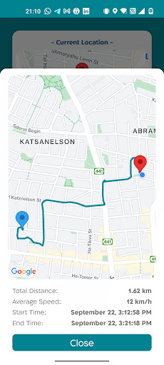
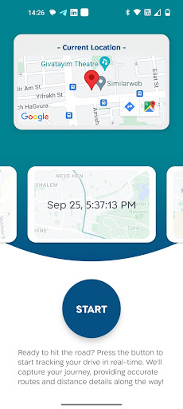

# 🚗 RoadRecorder (Android Only)

**RoadRecorder** is a **GPS-powered Android app** that tracks users’ locations in real time, displays directions on **Google Maps**, generates route-based **analytics**, and provides **geofencing notifications** via a custom **native module**.

> ⚠️ **Note:** This project is **Android-only** and for **demo purposes** — showcasing location tracking, Google Maps, geofencing, and route analysis in a React Native environment.

\*\*\* Add your Google API Key to local.properties as: MAPS_API_KEY="..."

---

## 🧩 Overview

RoadRecorder brings together **real-time GPS tracking**, **map navigation**, and **intelligent geofencing** to help Android users analyze their trips, monitor routes, and receive notifications when entering or leaving specific geographic zones.

---

## ✨ Key Features

- 🗺️ **Real-Time Location Tracking**  
  Continuously tracks the user’s movement with GPS precision.

- 📍 **Google Maps Integration**  
  Displays routes, live directions, and position markers with smooth animations.

- 🚧 **Geofencing Notifications** _(via native Android module)_  
  Triggers alerts when entering or exiting pre-defined areas.

- 📊 **Route Analysis**  
  Generates basic route analytics such as distance, speed, and duration.

- 🔔 **Background Tracking**  
  Keeps recording location data even when the app is minimized.

- 🧱 **Modular Architecture**  
  Built with scalability and native Android integrations in mind.

---

  
  

